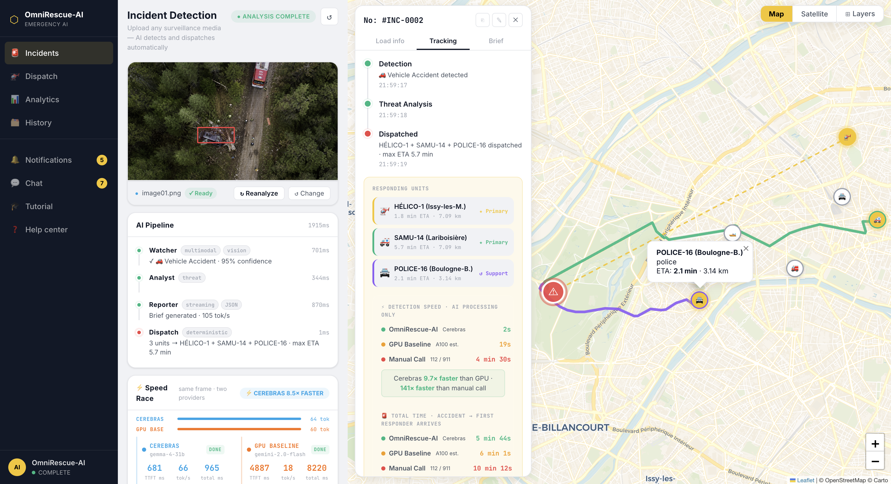
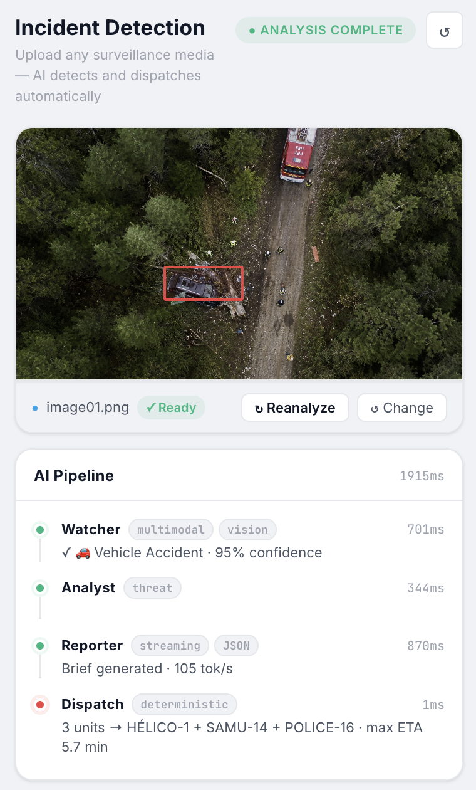
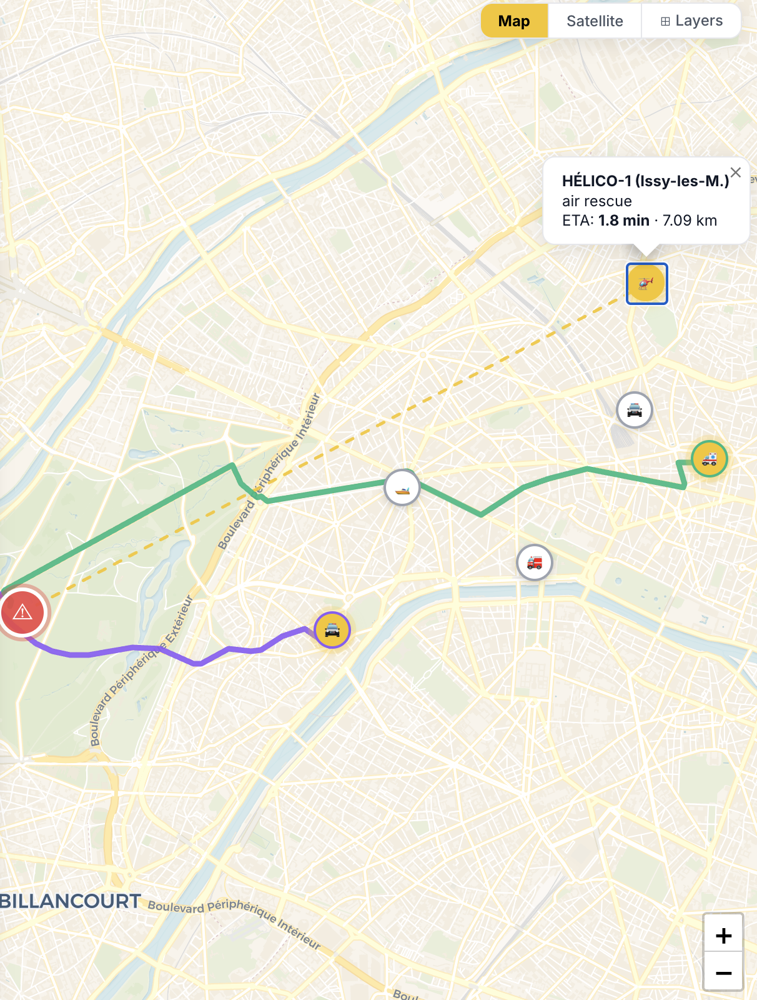
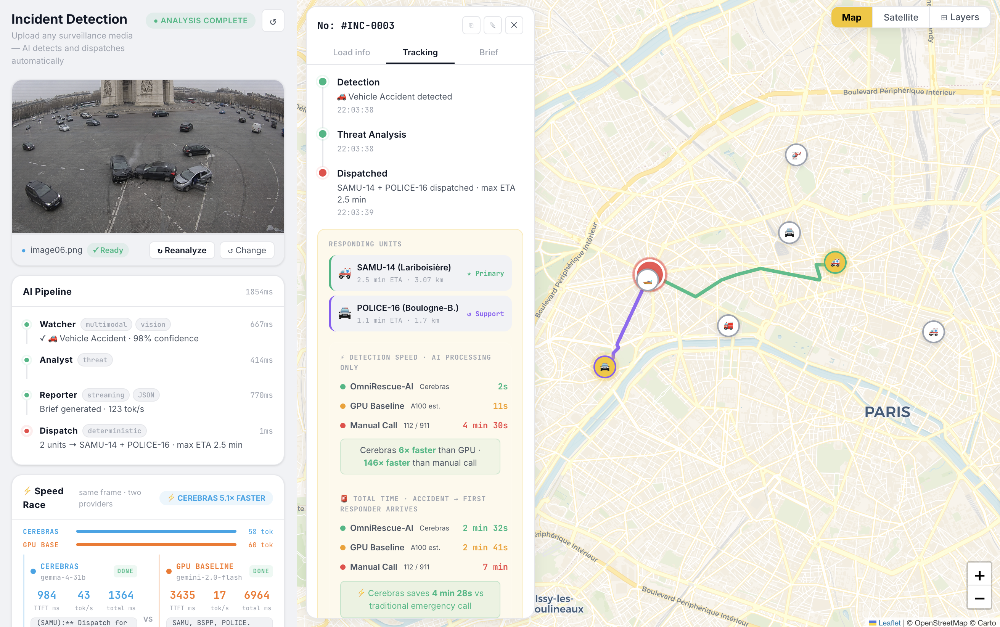
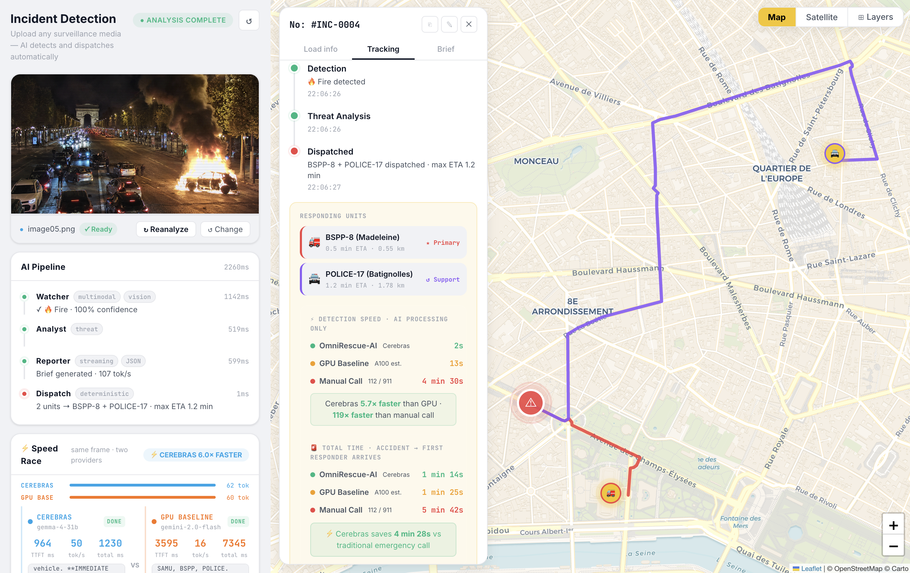
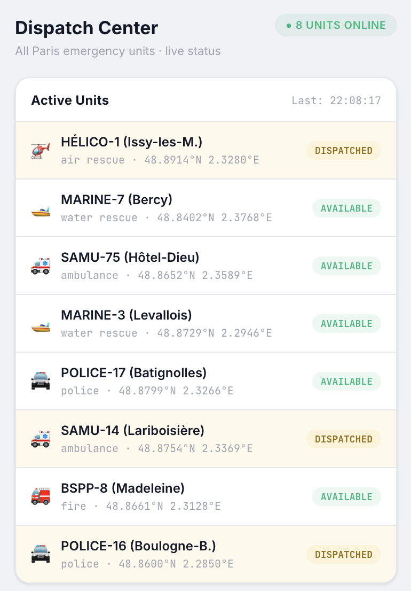
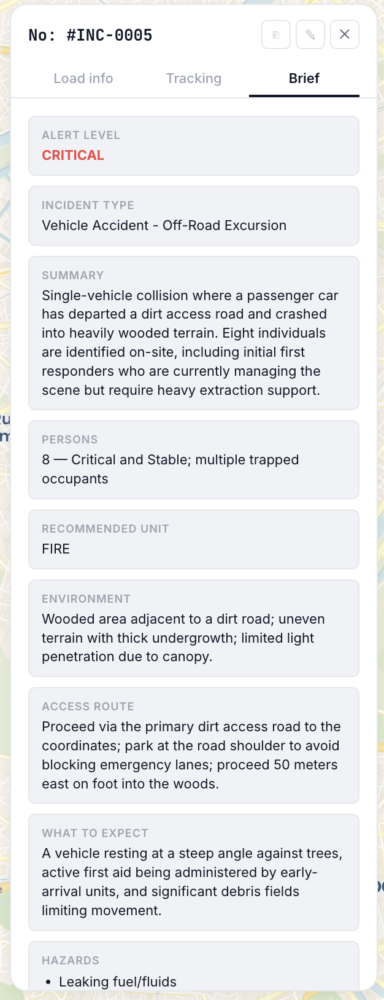

# 🚨 OmniRescue-AI

OmniRescue-AI is a real-time multi-agent emergency response system that detects incidents from surveillance footage and dispatches the right rescue units in under 2 seconds — before a person could finish dialing 112.

The system watches a camera frame, classifies the emergency type, assesses the threat level, generates a responder brief that units receive before they arrive, and triggers a coordinated multi-unit dispatch with real road routes drawn live on a Paris map. The entire pipeline runs on **Gemma 4 31B via Cerebras inference hardware**, making it fast enough to operate as a continuous surveillance layer rather than a one-shot tool.

The core question this project explores is one that matters for emergency response at scale: **how much faster is Cerebras custom silicon compared to a standard GPU server, and does that speed difference translate into real lives saved?** To answer it, OmniRescue-AI includes a built-in Speed Race that runs the same prompt simultaneously on Cerebras and a GPU baseline, and a Response Time Comparison that shows the difference between AI-assisted dispatch, GPU-assisted dispatch, and a traditional emergency phone call — for every single incident.

This project was built for the **Cerebras × Google DeepMind Gemma 4 Hackathon 2026, Track 02**.

## 🧰 Technologies

- `Node.js`
- `Express`
- `JavaScript` (Vanilla ES2022, no framework)
- `Cerebras Inference API`
- `Gemma 4 31B`
- `OpenRouter`
- `Leaflet.js`
- `OSRM` (Open Source Routing Machine)
- `NDJSON Streaming`
- `HTML / CSS`

## ✨ Features

Here is what OmniRescue-AI can do:

- **🔭 Watcher Agent:** A multimodal vision agent analyzes any uploaded surveillance frame using Gemma 4 31B. It classifies the emergency kind (vehicle accident, fire, flooding, person in distress, multiple casualties), assigns a confidence score, identifies the Paris landmark visible in the image, and determines the terrain type (road, water, forest, building).

- **🧠 Analyst Agent:** A threat assessment agent reads the Watcher output and produces a structured tactical assessment — severity level, immediate dangers, and what units need to know before they move.

- **📋 Reporter Agent:** A streaming brief agent generates a full responder brief transmitted to units en route. The brief includes patient condition, visible injuries, hazards, access route, what to expect on arrival, and immediate actions needed. It streams token-by-token and is readable inside the app before units even leave their station.

- **🚁 Dispatch Agent:** A deterministic multi-unit dispatch engine selects the right combination of units based on the incident kind and terrain. Each incident kind maps to a primary specialist and a police support layer. Forest terrain replaces water rescue with helicopter. Water mass casualties prepend the marine unit. The nearest unit of each required type is selected using haversine distance from the AI-identified incident location.

- **🗺️ Real Road Routing:** Each dispatched unit gets its own colored polyline drawn on the Leaflet map using the OSRM public routing API. Routes follow actual Paris streets. Helicopters get a dashed straight line. All routes draw in parallel and appear progressively as OSRM responds.

- **📍 16 Paris Incident Zones:** The Watcher AI identifies the location from visual landmarks in the image and returns a location hint matched to one of 16 named Paris zones — from Notre-Dame to Bois de Boulogne to Versailles — each with real GPS coordinates used for dispatch routing.

- **⚡ Speed Race:** Every analysis triggers a parallel race between Cerebras and a GPU baseline (OpenRouter free tier, with simulation fallback). The race runs the same prompt on the same frame and measures TTFT, tokens per second, and total time. The result shows how many times faster Cerebras is.

- **⏱️ Response Time Comparison:** Below the dispatched unit cards, a three-row comparison shows the total time from accident to first responder arrival for OmniRescue-AI on Cerebras, the GPU baseline, and a traditional manual emergency call. The Detection Speed section uses a logarithmic scale so the sub-second Cerebras bar stays visible next to the 4-minute manual call bar. The speedup ratio is derived directly from the actual race measurements so both panels always agree.

- **🚒 8 Active Paris Units:** HÉLICO-1, MARINE-7, MARINE-3, SAMU-75, SAMU-14, BSPP-8, POLICE-17, POLICE-16 — all with real GPS coordinates, unit types, and live dispatch status shown on a dedicated Dispatch Center view.

- **🗂️ Full Session Tracking:** Every incident is logged with an INC number, timestamp, detection result, dispatched units, ETA, and alert level. The History view keeps a table of all incidents from the session. Analytics tracks scan count, incident rate, and per-agent latency.

## 🧪 The Process

The project started from a single observation: in a real emergency, the bottleneck is not the ambulance — it is the 3 to 5 minutes of overhead between the accident happening and the first unit actually moving. Someone has to notice the incident, find their phone, dial the emergency number, explain the situation to a dispatcher, and wait while the dispatcher manually identifies and alerts the nearest unit. AI can compress that entire chain to under 2 seconds.

The first version was a simple detection pipeline: upload an image, get a JSON result, dispatch one unit. The earliest bug was subtle — Cerebras rejects `json_schema` response formats that include `minItems` or `maxItems` on array fields with a silent 400 error. Every image was being classified as safe because the API was failing and the fallback was `incident_detected: false`. Removing the schema entirely and using prompt-based JSON with a robust `extractJSON()` parser fixed it. The same bug was silently breaking the Reporter agent: its streaming was failing on every call, the fallback object was returned without ever emitting tokens, and the Brief tab was always blank as a result.

The second major problem was that every image dispatched the same unit regardless of incident type. SAMU-75 from Hôtel-Dieu was always selected because the dispatch logic included ambulance in too many incident kind mappings, and SAMU-75 happened to be the closest unit to the Paris center fallback coordinate. The fix was two-part: make each kind map to exactly one primary unit type, and let the Watcher AI identify the real incident location from landmarks in the image rather than always defaulting to the city center.

After location detection worked, the map moved from a single static marker to a full routing system. Getting OSRM to draw real road routes required careful coordinate order handling — OSRM uses `[lng, lat]` (GeoJSON order) while Leaflet uses `[lat, lng]`. The routes now draw in parallel for all units using `Promise.all`, which means all routes appear quickly without waiting for them sequentially.

The Speed Race and Response Time Comparison were added last. The challenge was consistency: the race panel and the detection speed panel were computing GPU times independently with different formulas and the numbers contradicted each other. The fix was to always store the GPU race result — whether real or simulated — and use the actual observed ratio to derive the detection speed numbers, so both panels always agree on the same speedup figure.

## 📚 What I Learned

**🧩 Multi-agent systems fail in specific, non-obvious ways:**
Each agent in the pipeline can fail silently. The Watcher 400 error, the Reporter schema bug, the dispatch location fallback — none of them threw visible exceptions in the UI. Building explicit fallbacks and logging at every agent boundary is what made each bug findable.

**🔌 API constraints are not always documented:**
The Cerebras rejection of `minItems` and `maxItems` in JSON schema is not prominently documented. The only way to find it was to log the raw HTTP response body. Every inference provider has edge cases like this; building resilient extraction through prompt-based JSON and a robust parser is safer than trusting schema enforcement.

**📍 Location matters as much as classification:**
Knowing that an incident is a vehicle accident is not enough. Dispatching the right unit to the wrong location is just as bad as dispatching the wrong unit. Having the Watcher identify the Paris landmark from the image and map it to real GPS coordinates changed the dispatch from a toy example to something that behaves like a real system.

**⚡ Parallelism is the right default:**
OSRM route fetches, the Cerebras and GPU race, and the agent pipeline events on the client all benefit from parallelism. Defaulting to `Promise.all` wherever there are no strict dependencies made every part of the experience faster and more responsive.

**📊 Speed comparisons need a single source of truth:**
The race panel and the response time panel both show a speedup ratio. When they computed it independently they disagreed, and the inconsistency was immediately noticeable. Deriving both from the same race measurement made the data coherent and trustworthy.

**🎨 UI feedback is part of the product:**
Straight polylines looked like a broken prototype. Real OSRM road routes changed the map from a diagram into something that felt like an actual dispatch system. The progressive drawing of routes as each OSRM call resolves is more compelling than having everything appear at once, because it shows the system working in real time.

## 🚧 How It Can Be Improved

- 🔑 Add authentication so only authorized operators can access the dispatch interface.
- 📹 Add support for continuous video stream analysis instead of frame-by-frame uploads.
- 🗄️ Persist incidents, unit status, and dispatch history to a database across sessions.
- 🔔 Add real push notifications to unit devices when a dispatch is triggered.
- 🗺️ Integrate a live unit tracking API so unit positions update in real time rather than using static coordinates.
- 🌍 Expand beyond Paris with configurable city scenarios and unit pools.
- 🧪 Add a formal evaluation benchmark for Watcher classification accuracy across incident types.
- 🐳 Add a Docker setup for one-command production deployment.
- 📡 Replace the simulated GPU baseline with a persistent OpenRouter connection using a paid key.
- 🔊 Add voice output so dispatched units receive the responder brief as audio en route.
- 🛡️ Add a formal audit log for every dispatch event with operator identity and timestamp.

## 🎬 Quick Demo

This demo uses real surveillance and dashcam images to show the full pipeline — from frame upload to multi-unit dispatch with live road routing and speed comparison.

### 1. Upload a surveillance frame

The operator drops any image into the upload zone — dashcam footage, drone camera, CCTV still. OmniRescue-AI accepts JPG, PNG, MP4, MOV, and WEBM. For video, a frame capture tool lets the operator pick the exact moment to analyze.

<p align="center">
  
</p>

### 2. The AI pipeline runs in under 2 seconds

The 4-agent pipeline fires sequentially. Each agent lights up green as it completes:

- **Watcher** classifies the incident kind and confidence from the image
- **Analyst** produces a threat assessment
- **Reporter** streams the responder brief token by token
- **Dispatch** selects and triggers units in under 1ms

<p align="center">
  
</p>

### 3. Live road routes appear on the Paris map

As soon as dispatch fires, the map fetches real road routes from OSRM for each responding unit. Each unit gets its own colored polyline following actual Paris streets. The incident marker pulses at the AI-identified landmark location.

<p align="center">
  
</p>

### 4. Vehicle accident at Arc de Triomphe — INC-0016

A dashcam image of a collision at the Arc de Triomphe roundabout. The Watcher identifies the location, dispatches SAMU-14 (Primary) and POLICE-16 (Support), and draws road routes from both stations to the incident.

<p align="center">
  
</p>

**Detection results:**
- Incident: 🚗 Vehicle Accident · 98% confidence
- Location identified: Arc de Triomphe
- Units: SAMU-14 (2.5 min ETA · 3.07 km) · POLICE-16 (1.1 min ETA · 1.7 km)
- Cerebras pipeline: **1963ms**
- OmniRescue-AI total arrival: **2 min 32s**
- Manual call total arrival: **7 min**
- Cerebras saves: **4 min 28s** vs traditional emergency call

### 5. Fire detection — Champs-Élysées

A nighttime image of a burning vehicle on the Champs-Élysées. The Watcher classifies it as fire on road terrain, dispatches BSPP-8 (Primary) and POLICE-17 (Support), and the Speed Race shows Cerebras completing in 1554ms against the GPU baseline at 8401ms.

<p align="center">
  
</p>

**Detection results:**
- Incident: 🔥 Fire · 99% confidence
- Units: BSPP-8 (0.5 min ETA · 0.55 km) · POLICE-17 (1.2 min ETA · 1.78 km)
- Speed Race: **⚡ CEREBRAS 5.4× FASTER**
- Detection speed: Cerebras 2s · GPU 8s · Manual 4 min 30s

### 6. Dispatch Center — live unit status

The Dispatch Center view shows all 8 Paris units with their type, coordinates, and live status (AVAILABLE / DISPATCHED). The Dispatch Log records every triggered unit with incident type, ETA, and timestamp.

<p align="center">
  
</p>

### 7. Responder Brief — streamed before units arrive

The Brief tab shows the full responder brief generated by the Reporter agent. It streams token by token and is complete before units reach the scene, giving responders specific hazard information, patient condition, and immediate actions before they step out of the vehicle.

<p align="center">
  
</p>

## 📊 Benchmark Results

These results are from live runs using real surveillance images. Cerebras pipeline time is the sum of actual agent durations reported by the server. GPU time is derived from the Speed Race and reflects the full 3-agent inference pipeline on shared A100 hardware.

### ⚡ Detection Speed

| Provider | Detection Time | vs Cerebras |
|---|---:|---:|
| OmniRescue-AI (Cerebras) | ~2s | baseline |
| GPU Baseline (A100 est.) | ~15s | 7–9× slower |
| Manual Call (112 / 911) | ~270s | 135× slower |

### 🏁 Speed Race — Sample Results

| Image | Cerebras | GPU Baseline | Speedup |
|---|---:|---:|---:|
| Vehicle accident (Arc de Triomphe) | 1072ms | 9261ms | **8.6×** |
| Fire (Champs-Élysées) | 1554ms | 8401ms | **5.4×** |
| Vehicle accident (Boulogne area) | 2304ms | 6643ms | **2.9×** |

### 🚨 Total Time · Accident → First Responder Arrives

| Scenario | AI Overhead | Unit ETA example | Total |
|---|---:|---:|---:|
| OmniRescue-AI (Cerebras) | ~2s | 2 min 30s | **~2 min 32s** |
| GPU Baseline (A100 est.) | ~15s | 2 min 30s | **~2 min 45s** |
| Manual Call (112 / 911) | ~270s | 2 min 30s | **~7 min** |

## 🚀 Running the Project

### Prerequisites

- Node.js 18+
- A Cerebras API key — [cerebras.ai](https://cerebras.ai)
- An OpenRouter API key — [openrouter.ai](https://openrouter.ai) *(optional — GPU baseline falls back to simulation when unavailable)*

### Setup

```bash
git clone https://github.com/yourusername/omnirescue-ai
cd omnirescue-ai
npm install
```

Create a `.env` file at the project root:

```env
CEREBRAS_API_KEY=csk-your-key-here
OPENROUTER_API_KEY=sk-or-v1-your-key-here
PORT=3000
```

### Start

```bash
npm start
```

Then open:

```
http://localhost:3000
```

For development with auto-reload:

```bash
npm run dev
```

## 🗂️ Project Structure

```
OmniRescue-AI/
│
├── server.js                  # Express server — /api/respond and /api/race endpoints
├── package.json
├── .env
│
├── agents/
│   ├── watcher.js             # Multimodal detection — Gemma 4 31B vision, prompt-based JSON
│   ├── analyst.js             # Threat assessment — text inference
│   ├── reporter.js            # Streaming responder brief — SSE token stream
│   └── dispatch.js            # Deterministic multi-unit dispatch — haversine routing
│
├── lib/
│   ├── cerebras.js            # Cerebras Inference API client (chat, vision, streaming)
│   ├── openrouter.js          # OpenRouter client — GPU baseline for Speed Race
│   ├── gemini.js              # Gemini client (fallback, legacy)
│   ├── locations.js           # 16 named Paris incident zones with GPS coordinates
│   └── scenarios.js           # Paris unit pool — 8 units with type, position, label
│
└── public/
    ├── index.html             # Single-page app — 8 views, alert panel, map
    ├── app.js                 # Client logic — pipeline, OSRM routing, race, session state
    └── styles.css             # Dark UI, unit cards, route colors, comparison bars
```

## 🎥 Demo Video

<p align="center">
  <a href="https://x.com/yaxindev/status/2071638918106087821">
    
  </a>
</p>

## ⚠️ Important Note

OmniRescue-AI is a technical prototype built for a hackathon. It is not a certified emergency dispatch system. Unit positions, ETAs, and routing are approximations based on static coordinates and public map data. The GPU baseline comparison uses a simulation when the OpenRouter free tier is rate-limited. Do not use this system to make real emergency dispatch decisions.
